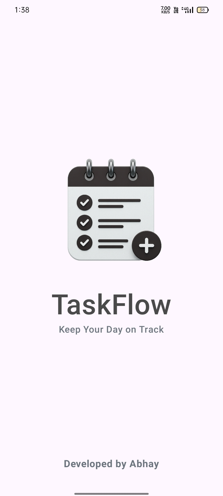
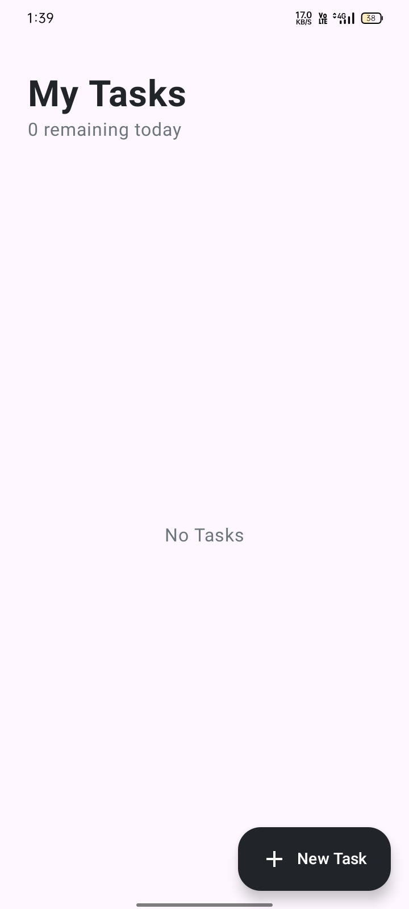
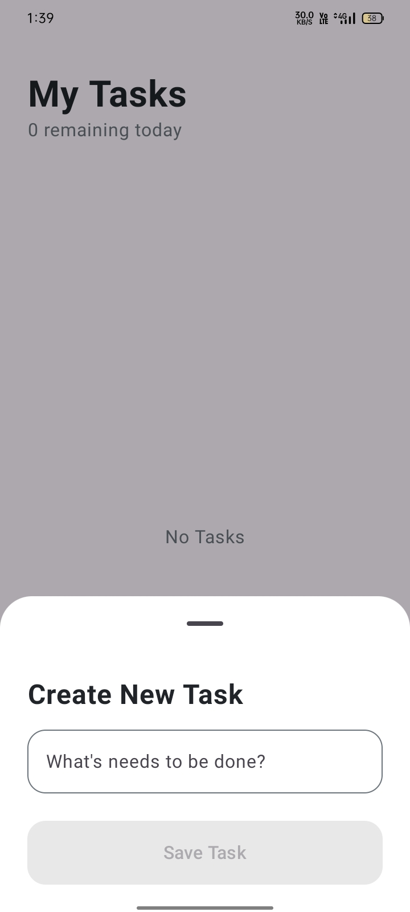
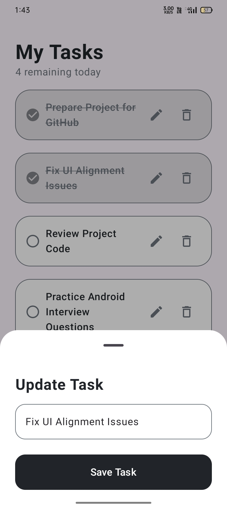
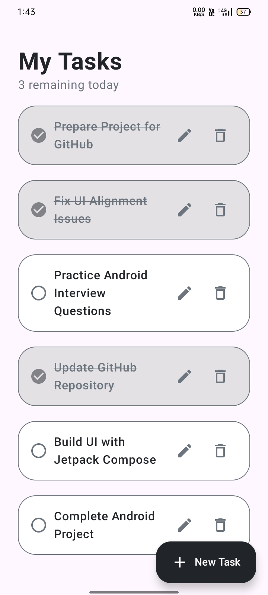

# TaskFlow – To-Do List 📋

A simple To-Do List app built with Kotlin, Jetpack Compose, Room Database, and MVVM.

## ✨ Features

- Add new tasks
- Update existing tasks
- Mark tasks as completed
- Delete tasks
- View remaining and completed tasks
- Local data storage using Room Database
- Clean UI built with Jetpack Compose

## 🛠️ Tech Stack

- **Kotlin**
- **Jetpack Compose**
- **Room Database**
- **MVVM Architecture**

## 📱 Screenshots

<table>
  <tr>
    <td align="center">
      <b>Splash Screen</b>  
      
    </td>
    <td align="center">
      <b>Home Screen</b>  
      
    </td>
    <td align="center">
      <b>Create New Task</b>  
      
    </td>
  </tr>
  <tr>
    <td align="center">
      <b>Update Task</b>  
      
    </td>
    <td align="center">
      <b>Task List</b>  
      
    </td>
  </tr>
</table>
